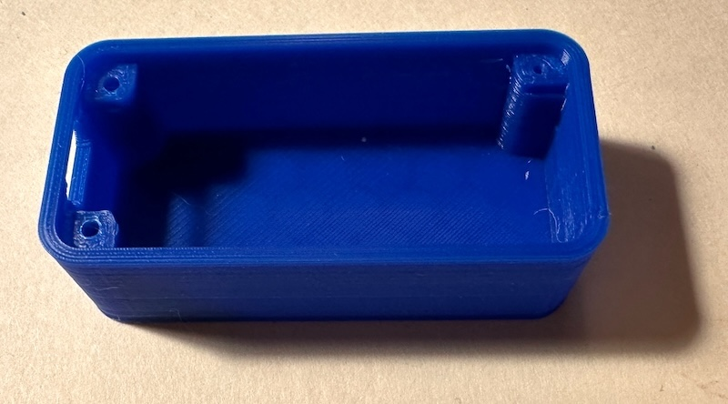

## diceroll_feather

I recently bought a board game that was missing a specialized die. Clearly the easiest solution to that problem was to build a little electronic keychain 'dice roller'.

<!-- demo video -->
https://github.com/icegoat9/diceroll_feather/assets/85364179/eb14111a-678f-439f-8b59-4e56392dd97d

**Features:**
* Press top button to roll a die
* Press middle button to cycle through a custom list of dice to roll (here: D3, D6, D10, D20, D100)
* Numbers on dice can be configured to start at 1 (D6, D20) or 0 (D10, D100)
* Dice can also display symbols (e.g. D3 rolls a "-", "O", or "+", for a specific game)
* Small battery that charges over USB-C port
* Standby battery life of many months (the system goes into a light sleep mode to save power after a short period of inactivity, and a deeper sleep mode after minutes of inactivity).
## Hardware

* Adafruit [ESP32-S3 Feather with reverse-mounted TFT](https://www.adafruit.com/product/5691)
* Various batteries, most recently [Lithium Ion Polymer Battery, 3.7V 400mAh](https://www.adafruit.com/product/3898)
* For cleaner packaging (requiring minor desoldering), JST surface mount straight header e.g. [JST B2B-PH-SM4-TB](https://www.digikey.com/en/products/detail/jst-sales-america-inc/B2B-PH-SM4-TB)
* [Case](case/) (3D printed, with button inserts)
  * Nominally, 2 each M2 and M2.5 BHCS fasteners, but a few dots of superglue may be easier...

## Development Log

Hooking together some parts I had laying around to experiment with this particular SPI-interface display and the CircuitPython ecosystem:

In a few hours I had a working battery-powered prototype I could use:

However, the battery drained in about an hour-- that's not especially useful. I put the project on the back burner for a few weeks, but wrote some code to experiment with different power savings such as dimming or turning off the display, disabling unused peripherals, and various ESP32 sleep modes, and left prototypes running for days and weeks to log battery level over time:

For cleaner packaging than just "a PCB double-stick-taped to an unprotected LiPo battery", I prototyped a few cases. It was inconvenient that the battery needs to enter on the side of the PCB, so I carefully desoldered the right angle battery connector and replaced it with a straight through connector (I also desoldered the unused Stemma QT I2C connector on the back of the Feather to make more space for the battery):

**CAUTION:** I had to bend the pins on this straight-through connector 180 degrees (shown below after bending), because soldering the off-the-shelf straight-through connector into the existing location would have swapped + and - relative to the right angle connector, frying the board! Be careful that the polarization notch on the connector is consistent between the removed right-angle and replacement connector:

First PCB sandwich with a narrow 400mAh LiPo battery:

A quick case design, 3D printed by a friend in PLA ("a polyester made from fermented plant starch"):

Tapping fine threads directly into 3D printed plastics is a bit sketchy as a design practice compared to pressing in metal inserts, but if you undersize the holes a bit, use a jig, and have deep enough threads, it's possible... and I have a finished-enough portable device:

Finally, I came back to the software to add some light animations, a battery indicator, and a hybrid sleep mode for what should be months of battery life. This was a satisfying small project.

**v2 Update:**  

I put a bit more time into the project, mostly to design the new enclosure with buttons shown at the top of this page ([more details on the case design](case/)). I also took that opportunity to clean up and remove unused or debugging code and add a smarter battery icon.

The standby battery life seems excellent in practice-- over the past few months I've used this from time to time when playing a game (including the solo board game "Gloomhaven: Buttons & Bugs", which needs a special - / 0 / + die), and the battery finally ran down and needed a recharge after about six months (though it spent several of those months sitting unused).

## Installation

* Configure the Feather with CircuitPython 9.x
* Copy diceroll.py, code.py, and the lib/ folder onto the Feather

## Possible Future Work

This is 'good enough' for now, and I was trying to keep this a quick side project-- I don't expect to put more time into this unless inspiration strikes, but a few ideas I could come back to some day:

* ~~Revise the enclosure to cover the edges of the display, add button caps, and be less boxy overall~~
* ~~Buy my own 3D printer rather than depending on a friend's or paying every time I want to revise a design...~~
* Look into improving the performance of drawing vector shapes for a faster 'die rolling' animation
* Dig deeper into ESP32 sleep modes and ways to extend battery life outside of deep sleep-- battery life is already great, but perhaps this could enable an even smaller battery and package
* Add the ability to roll multiple dice at once (e.g. 2D6), including some visualization of each die, not just a total
* Add a whole configuration mode / menu (entered by the third button), to let you adjust parameters such as the sleep delay, the animation speed, the list of dice options, and so on, without having to edit and reload code
  * Persist all of these settings in backup RAM through deep sleeps, or maybe even to onboard flash when power is lost *(I don't really need any of these features, but menu+configuration+persistence could be useful in a future project...)*
