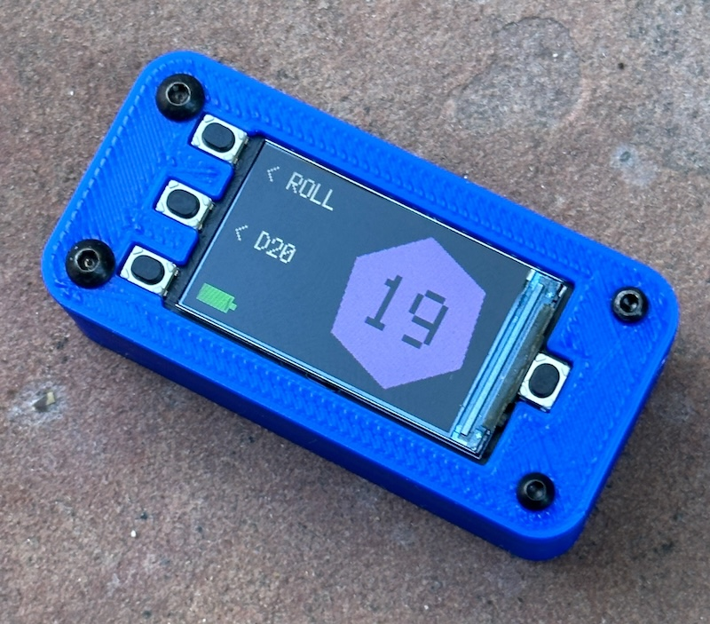

This folder contains the current STL files for three case variants:
1. A simple case variant that leaves some of the PCB exposed
2. A case with button inserts and rear fasteners for a cleaner look (note: tapping tiny threads into a PLA 3D print of this is very difficult-- I may redo in a different material or redesign to use press-in threaded inserts)
3. A quick variant on case #2 but with pins, to be glued together (simpler than dealing with threads for now)

## Details

A few steps from along the way...

Design #1 is the simple case I got a friend to 3D print. It looked good enough:

Months later when I picked up my own 3D printer I was inspired to iterate on a design with button inserts and rear-mount fasteners:

This case mostly works, but tapping M2 and M2.5 threads into 3D printed PLA was challenging, especially into these shallow blind holes. I have an M2.5 bottoming tap but don't have the equivalent in M2, and went through three copies of the top plate before I got 3/4 of the threads tapped and it would assemble. Then I realized I was missing matching black oxide fasteners in the correct lengths.

I didn't want to wait to get new hardware, so I made a minor variant on it, with locating pins on the bottom piece that the PCB sits on rather than holes for screws. With a thin bead of cyanoacrylate it came together nicely, I'll just have to break it open if I ever want to service it...

