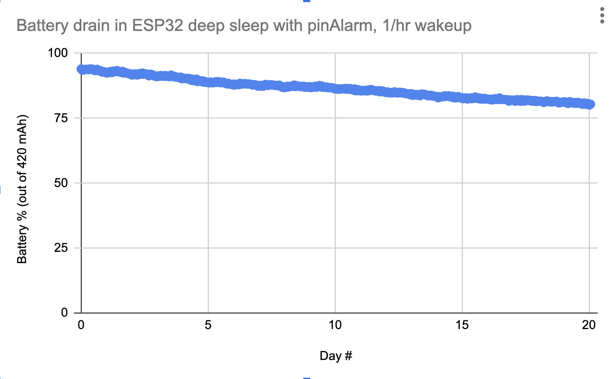

### Battery usage experiments / scratchpad

Testing with a 420mAh LiPo battery (plan to use an even smaller one) using the MAX1704x i2c battery fuel gauge reported values:

With display on and active (Neopixel power is always off), presumably high power draw:
* 63% at 6:17pm
* 19% at 6:30pm
* Rough extrapolation (if battery meter and capacity are correct) suggests 44% drain / 13min = 184 mAh / 13min, ~850 mA!?
* At this high discharge rate (> 1C) using a smaller battery will be an issue...

With display and I2C powered down (but not using any microprocessor sleep mode, and WiFi / Bluetooth may be on in background? unclear):
* 39% at 5:15pm
* 27% at 5:28pm
* 25% at 5:30pm
* Rough extrapolation (if battery meter and capacity are correct) suggests 56% drain / hour or 235 mAh / hour = 235 mA!?
* At this moderately high discharge rate (~0.5C for this battery), using a much smaller battery may be an issue

Using microprocessor sleep modes (see [CircuitPython reference](https://learn.adafruit.com/deep-sleep-with-circuitpython/alarms-and-sleep)):

With microprocessor in light sleep (which should power down WiFi as well), and display and I2C powered down:
* 18% at 6:31pm
* "18%" at 6:35pm? though maybe battery meter hasn't kept up, if I2C power is down does that mean it's not tracking? hmm...
* 8% at 7:09pm
* This suggests 10% / 38min or 16% drain / hour or 66 mAh drain / hour, ~66mA!? (significantly higher than expected for sleep mode, maybe there are more peripherals to turn off...)

Second test:
* 94% at 9:10pm
* 84% at 9:48pm
* Suggests ~6hr lifetime, not great (~66mA draw estimated again-- something is still a big draw)

Third test, after adding `import wifi` and `wifi.radio.enabled = False` (not sure if that will change anything vs. not importing wifi in the first place?)
* 85% at 9:53pm
* 73% at 10:21pm
* Suggests ~25%/hr discharge or ~4hr lifetime, not notably different from without those wifi lines

Another test, now with D0 as trigger / wakeup pin, and fractional percent reporting
* 2:44pm 93.7% (surprisingly high given we were just at 69% recently and only briefly plugged in, I'm skeptical at first that it's this high)
* 3:15pm 76.3% (= 17.4% in 31min or about 35% capacity / hr or ~140mA estimated!? unless previous capacity was artificially high)
* 3:26pm 70.3$ (= 6% in 11min or ~36% / hr, again, hmm)

With microprocessor in deep sleep, and display and I2C powered down: (temporary test w/ D0 as wake pin instead of D2 for deep sleep...)
* 70% at 10:25pm 4/22
* 69% at 10:55pm (ooh, more promising...)
* 69% at 7:38am 4/23 (aha! still very long life... assuming battery gauge is still working... does it need more time to register?)
* 69% at 10:16am and 11:40am and 12:42pm and 2:30pm ! -- then stopped test. Not convinced I'm getting good data? TBD

Further sleep testing with dedicated test_power_usage.py: (**see photos taken 2024-04-23 of displayed results**):
* S0: ~107 mA
* S1: ~150 mA!? (doesn't make sense that this would be higher than S0... but only tested over the course of a few minutes, but maybe it's the S0 that's low)
* S2: ~130 mA!? averaged over 2400s (consistent with some earlier tests)

Further testing after recharging battery to near full
* S0: n/a (high, 100mA or more)
* S1: ~80mA? (but over just 5min so not much battery% delta to work with) 
* S2: mA? (but over just 5min so not much battery% delta to work with) 
* S3: mA? 

2024-04-27 long-running battery study involving systems waking themselves up every 30-60min to log battery state to on-board Flash (also means we don't need to directly depend on battery charge meter being correct, as we'll see when the device drains enough to stop logging):
* One device with 420mAh battery set to deep sleep for 1 hour, wake up for 1 second (plus boot-up so ~5s) and log to flash
  * Lasted multiple days, so left running
* One device with 400mAh battery set to light sleep (which has seemed ineffective) with TFT and I2C off for 30min, wake up for 1s to log to flash, repeat
  * Still only lasted 3.5 hours of light sleep

2024-May long-running battery study, with system that deep sleeps and wakes once an hour to log battery to on-board Flash, with pinAlarm also enabled (though not used) for comparable test to diceroll trinket:
* 420 mAh battery lost 14% in 20 days, suggesting months of deep sleep

The same test device was still alive as of ~early July (not used for past month), and was at ~50% battery?, so we do have many months of deep sleep if not in use, though it's not running identical code.

### Battery Packaging Dimensions

Feather relevant dimensions:
* 2.0" x 0.9" outer dimensions
* Two mounting holes are at 0.7" spacing, and are 3mm diameter holes (M2.5 or #4-40 screw), the other two are for M2 screws and are spaced differently but 1.8" away
* So, the rectangle fully inside of mounting holes in both directions would be at about 1.68" x 0.58"
  * Or 2.0 x 0.58 or 1.68 x 0.9" if we want a rectangle that clears mounting holes in one of the two directions and goes to board outline in the other
* There's just 1.4" length 'beyond the battery connector to the other end of board' (since battery connector is thick and we may want to avoid)
  * If we want to clear the mounting holes as well, we lose 0.16" so would have about 1.24" x 0.9" space

Small batteries sold by Adafruit:
* 500 mAh: 1.15 x 1.4 x 0.19"
* 420 mAh: 1.38" x 0.94" x 0.20"
* 400 mAh 1.41" x 0.67" x 0.31" (special "narrow for between feather headers", but thicker)
* 350 mAh  1.4" x 0.8" x 0.22"
* 350 mAh short cable  1.3" x 1.0" x 0.2"
* 150 mAh  0.77" x 1.02" x 0.14"
* 100 mAh  0.45" x 1.2" x 0.15"

So, what fits fully within the "rectangle that's within the mounting hole profile in one direction, and within board in the other?
* 100, 150, 350, 400narrow

Do any fit the "downstream of battery connector between that and mounting holes of 1.24 x 0.9"?
* 100, 150

None fit downstream of Stemma QT connector without also blocking mounting holes? But 150mAh probably just fits if it blocks those two holes...

If we're willing to only use three of the four mounting holes, though, and obstruct one of the smaller mounting holes with the battery, the 400mAh narrow battery should just fit.